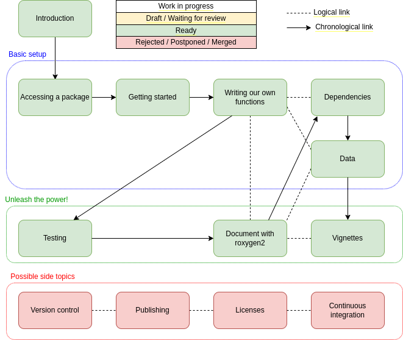

# Packaging with R

## Teaching this lesson?
Do you want to teach this lesson? This material is open-source and freely available. 
Are you planning on using our material in your teaching? 
We would love to help you prepare to teach the lesson and receive feedback on how it could be further improved, based on your experience in the workshop.

You can notify us that you plan to teach this lesson by creating an issue in this repository. Also, it would be great if you could update [this overview of all workshops taught with this lesson material](workshops.md). This helps us show the impact of developing open-source lessons to our funders.

## Current status

Source [here](https://drive.google.com/file/d/1v4s5pZE6unPlrqsB5DLN1kGLkrVNBX8e/view?usp=sharing).

## Activity log

### May 2023
- Update the materials to use the new [Carpentries Workbench](https://carpentries.github.io/workbench/).

### April 2022
- Transfer the materials to the [Carpentries Incubator](https://github.com/carpentries-incubator/lesson-R-packaging).

### March 2022
22-24 March, [pilot online lesson](https://esciencecenter-digital-skills.github.io/2022-03-22-ds-rpackaging/) at the Netherlands eScience Center.

### Late autumn sprint
6-10 December 2021. Pablo Rodríguez-Sánchez, Lieke de Boer
- Write draft episode about vignettes
- Start reviewing the whole course.
- Polished several minor issues.
- We have a beta!
### Early autumn sprint
20-23 September 2021. Pablo Rodríguez-Sánchez, Mateusz Kuzak
- Write 2 draft episodes
    - Dependencies
    - Data
- Strategic planning with Mateusz
### Summer sprint
9-13 August 2021. Pablo Rodríguez-Sánchez, Lieke de Boer

- Write 6 draft episodes
    - Introduction
    - Accessing packages
    - Getting started
    - Writing our own functions
    - Testing
    - Documenting your package
- Include figures and animations generated with [Peek](https://github.com/phw/peek)
- Start merging contents into main branch
    - The one chapter - one branch approach proved to not be a good idea
- Adapt initial plans to challenges discovered while writing and trying
- Use `README` for keeping members updated
    - Draw a _Current Status_ diagram
    - Add a _what to do next_ section
    - Add this _Activity log_
- Add `_meta` files
    - And create a related pull request in [next-lesson-template](https://github.com/esciencecenter-digital-skills/next-lesson-template/pull/4).

### Kick-off 2021
31 May - 4 June 2021. Pablo Rodríguez-Sánchez, Barbara Vreede, Mateusz Kuzak

- Brainstorm and plan the tentative structure
- Read the materials

## Contributing

We welcome all contributions to improve the lesson! Maintainers will do their best to help you if you have any
questions, concerns, or experience any difficulties along the way.

We'd like to ask you to familiarize yourself with our [Contribution Guide](CONTRIBUTING.md) and have a look at
the [more detailed guidelines][lesson-example] on proper formatting, ways to render the lesson locally, and even
how to write new episodes.

Please see the current list of [issues](https://github.com/escience-academy/lesson-R-packaging/issues) for ideas for contributing to this
repository. For making your contribution, we use the GitHub flow, which is
nicely explained in the chapter [Contributing to a Project](http://git-scm.com/book/en/v2/GitHub-Contributing-to-a-Project) in Pro Git
by Scott Chacon.
Look for the tag . This indicates that the maintainers will welcome a pull request fixing this issue.

## Maintainer(s)

Current maintainers of this lesson are

* Pablo Rodríguez-Sánchez [@PabRod](https://github.com/PabRod/)
* Lieke de Boer [@liekelotte](https://github.com/liekelotte)
* Michael Milton [@multimeric](https://github.com/multimeric)
* Sven van der Burg [@svenvanderburg](https://github.com/svenvanderburg)

## Authors

A list of contributors to the lesson can be found in [AUTHORS](AUTHORS)

## Citation

To cite this lesson, please consult with [CITATION](CITATION)

[cdh]: https://cdh.carpentries.org
[change-default-branch]: https://docs.github.com/en/github/administering-a-repository/changing-the-default-branch
[community-lessons]: https://carpentries.org/community-lessons
[lesson-example]: https://carpentries.github.io/lesson-example
