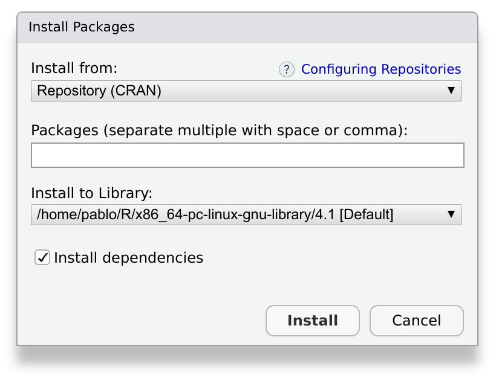

One of the advantages of packages is that they can be **installed** and **loaded**.
This allows us to use the functions contained in the package from anywhere.

There are many ways of accessing a package in order to start using it.
In this section, we will study the most common ones.
At the end, we'll describe briefly other alternatives that may be useful in some cases.
## Install a package from CRAN

[CRAN](https://cran.r-project.org/) is the official repository for R Packages.
It stands for the _Comprehensive Archive R Network_.
It is an awesome collection of high quality resources written by other R users just like you.

Installing a package from CRAN is particularly easy.
Let's imagine we need to install a package with tools for R developers.
We can start by browsing to our favorite search engine, and make a search like: _R developers tools_.
It will point us to a package called `devtools`.
The package can be installed by opening RStudio and browsing to the _Packages_ tab:


After pressing _Install_, a window like this will appear:



We write `devtools` in the prompt, and press install.
This operation will download and install the package and the required dependencies.
Depending on the package, it may take a while, ranging from a few seconds to a few minutes.

> ## The same, but with a command
> Some people may prefer using code instead of a graphical user interface to install a package.
> Are you one of them?
> Then, you'll like to know that all the above is equivalent to typing:
> 
> ```r
> install.packages("devtools")
> ```
>
> As often happens with RStudio, you don't have to remember this command by heart.
> You can keep using the graphical user interface and **observe** what happens in the console.
> RStudio will build and execute the command for you.
{: .callout}

After installing, the new package should appear in the _Packages_ tab.
> ## Something went wrong?
> Sometimes, an installation may fail.
> If that's the case, take a look at the output message in the console.
> It will contain very useful information, and direct suggestions about how to fix the problem.
{: .callout}

> ## Can I publish my package in CRAN?
> The answer is yes, and it is easier than you may think.
> We'll go back to this in chapter TODO.
{: .callout}


## Install a package from source

What if the package is only available in your computer?
This is the case of the one we are building during this lesson.

## Install a package from GitHub

Not all publicly available packages are available in CRAN.
...

