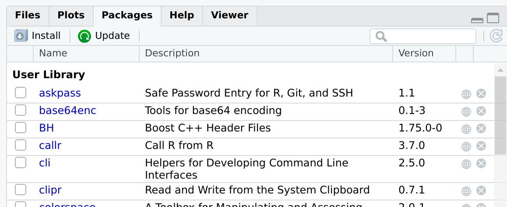
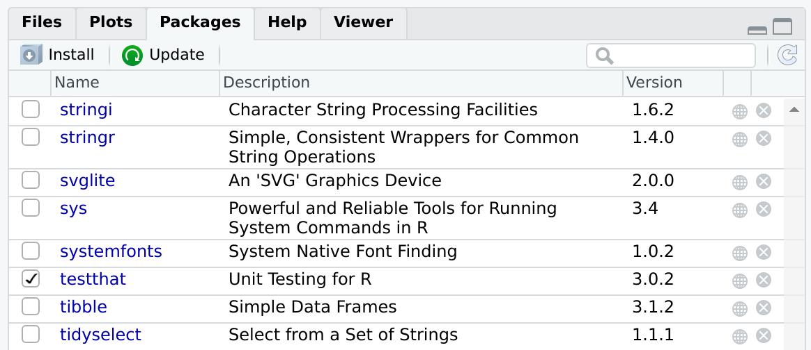

One of the advantages of packages is that they can be **installed**.
This allows us to use the functions contained in the package from anywhere.

There are many ways of accessing a package in order to start using it.
In this section, we will study the most common ones.
At the end, we'll describe briefly other alternatives that may be useful in some cases.
## Install a package from CRAN

[CRAN](https://cran.r-project.org/) is the official repository for R Packages.
It stands for the _Comprehensive Archive R Network_.
It is an awesome collection of high quality resources written by other R users just like you.

Installing a package from CRAN is particularly easy.
Let's imagine we need to install a package with tools for R developers.
We can start by browsing to our favorite search engine, and make a search like: _R developers tools_.
It will point us to a package called `devtools`.
The package can be installed by opening RStudio and browsing to the _Packages_ tab:



After pressing _Install_, a window like this will appear:


We write `devtools` in the prompt, and press install.
This operation will download and install the package and the required dependencies.
Depending on the package, it may take a while, ranging from a few seconds to a few minutes.

> ## The same, but with a command
> Some people may prefer using code instead of a graphical user interface to install a package.
> Are you one of them?
> Then, you'll like to know that all the above is equivalent to typing:
> 
> ```r
> install.packages("devtools")
> ```
>
> As often happens with RStudio, you don't have to remember this command by heart.
> You can keep using the graphical user interface and **observe** what happens in the console.
> RStudio will build and execute the command for you.
{: .callout}

After installing, the new package should appear in the _Packages_ tab.
> ## Something went wrong?
> Sometimes, an installation may fail.
> If that's the case, take a look at the output message in the console.
> It will contain very useful information, and direct suggestions about how to fix the problem.
{: .callout}

> ## Can I publish my package in CRAN?
> The answer is yes, and it is easier than you may think.
> We'll go back to this in chapter TODO.
{: .callout}

## Install a package from GitHub

Although CRAN is the official repository for R packages, it is not the only one.
As we've seen / we'll see in chapter TODO, GitHub, is the most popular open code repository.
We can use GitHub to find packages or to make our owns publicly available.

Let's imagine we want to install a package that is not available on CRAN, such as https://github.com/RETURN-project/BenchmarkRecovery TODO: find a better example.

In section TODO you learned / you'll learn how to publish your package on GitHub.


## Install a package from source

What if the package is only available in your computer?
This is the case of the one we are building during this lesson.

The easiest way to install a package from source is by opening the package project and using the _Build_ tab:


By pressing _Install and restart_ three things will happen:

1. The package will be, indeed, installed.
2. The R session will be restarted.
3. The package will be loaded (TODO: check if loaded or attached).

> ## Why would you want to load a package from source
> Can you think of a situation where you'll need to install and attach a package from source?
> > ## Solution
> > The most common situation is while you are developing a package.
> > Every now and then, you'll want to re-install and re-load it to check that everything is working as expected.
> >
> > Loading from source can be also useful if you want to use a colleague's package.
> > But we warned here.
> > In the next session we'll learn a much better way of sharing packages among your colleagues using GitHub.
> {: .solution}
{: .challenge}

## Attaching an installed package

In order to use an installed package, you need to load it into workspace.
Typically, you'll do it via attaching the package.
This means that its functions and data will become available in your working session, so you can use them in your console and your scripts.
Additionally, the functions in your package will be added to the search path.

The easiest way to attach an installed package is by using the _Packages_ tab.
If you click on the package's name, the package's help menu will open.
If you click on the checkbox by the package's name (see figure below), the package will be attached.



The figure above shows that the package `testthat` is installed and attached.
Other packages, such as `stringi`, `stringr` or `svglite`, are installed but not attached.
> ## What if we want to attach a package from the console?
> How would you attach an installed R package using the console?
>
> Tip: As always with RStudio, it is a good idea to look at the console while we are performing operations in the graphical user interface.
> > ## Solution
> > Use `library(<package name>)`.
> {: .solution}
{: .challenge}

> ## Using a function without attaching the package
> In some situations it can be a good idea to load individual functions from a given package, but not the package itself.
> This can be done using the syntax: `<package>::<function>`.
>
> For instance, if we want to use the function `filter` from the package `dplyr` we can call it directly as:
>
> ```r
> dplyr::filter()
> ```
> Keep in mind that for this to work, `dplyr` has to be installed.
{: .callout}

> ## To attach nor not to attach?
> If you are developing a package that depends on other packages, it is strongly recommended to call functions on the other packages using the syntax `<package>::<function>`. Conversely, it is strongly advised to not use `library(<package>)` inside a package.
> 
> Do you have any idea why?
> > ## Solution
> > The dependencies of a package can become tricky.
> > The more explicit the naming, the better.
> >
> > Additionally, we have to keep our potential users in mind.
> > We want our package to do its work and leave no trace behind.
> > Using `library(<package>)` inside the package will permanently alter the search path.
> {: .solution}
{: .discussion}
