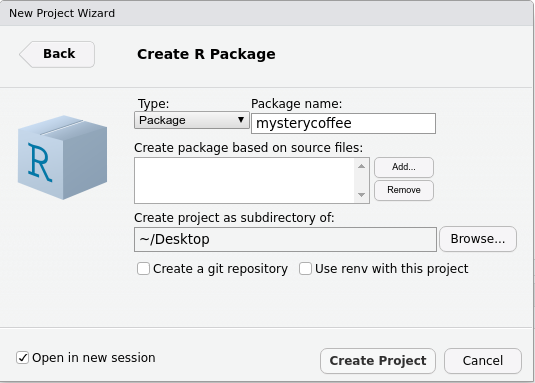

## A minimal package

The menus in `RStudio` will help us greatly, also for creating a package.
If you open `RStudio`, look at the upper left corner and press `File > New project > New directory`, you'll see a menu like this:

As you can guess, now we'll press `R package`.
The new menu asks us to fill some information.
For the moment, just stay with me and fill it like this:

Notice that:

- We gave the package a name: `mysterycoffee`.
- I created my package on my `~/Desktop` folder, but you can use another location if you prefer.
- We ticked `Create git repository`. We'll be back to `git` on episode FIXME.
- We left `Use renv with this project unticked`.
- We ticked `Open in new session`.

Now we are ready to press `Create Project`.

> ## What did just happen?
> After pressing `Create Project`, a new `RStudio` window should have appeared.
> The working folder should be `mysterycoffee`, and it should already have some contents:
> 
> 
>
> Also, the file `./R/hello.R` would appear open in the editor.
> This is an example file that will help you writing your first packaged R functions.
{: .callout}

> ## The `hello.R` file
> Take a look at the `hello.R` file.
> You'll see that it contains a tiny function and some comments.
> The comments are actually more important that the function itself.
> They contain very useful tips about how to install, check and test the package.
{: .callout}
> ## The `DESCRIPTION` file
> Open the `DESCRIPTION` file.
> What do you see here?
>
> Take 5 minutes to edit this file with the information it asks.
{: .callout}

## `roxygen2`

`roxygen2` is a package that makes writing packages much easier.
In particular, `roxygen2` takes care of your functions' documentation and the `NAMESPACE` file.
If you don't have it installed (you can check by trying `library(roxygen2)`), please do it now (`install.packages("roxygen2")`).

Unfortunately, using it requires manually configuring a few things.
Please follow these steps:

> ## Using `roxygen2` for the first time
> - Delete `NAMESPACE`. `roxygen2` will create a new one for you.
> - Delete the `man/` folder. `roxygen2` will create a new one for you.
> - In the upper right panel, go to `Build > More > Configure Build Tools`. You'll see a menu like this:
> 
> - Tick `Generate documentation with Roxygen`.
> A new menu will appear:
> 
> - Tick `Install and restart`.
>
> And you are all set!
{: .checklist}

Let's create our first `roxygen` skeleton.
You can follow the steps in the animation below.
Please note that, before pressing `Code > Insert Roxygen skeleton` your cursor has to be inside the function's body.

- The `return` field refers to the output. In this case, although something is printed to the screen, no output is provided (in the sense that `var <- hello()` is not assigned any value).
- The `export` field means that this function should be exported to the `NAMESPACE`.
- The `examples` field is used, as you can guess, for adding examples to the documentation. We'll not use it now, so we can delete it.

> ## Building the documentation (and NAMESPACE)
> If you configured `roxygen2` as we suggested in section _"Using `roxygen2` for the first time"_, the documentation will be generated every time you press _"Install and restart"_ in the _"Build"_ menu at the upper right side of `RStudio`. The tab will also contain a _"Document"_ only:
>
> 
>
{: .callout}


