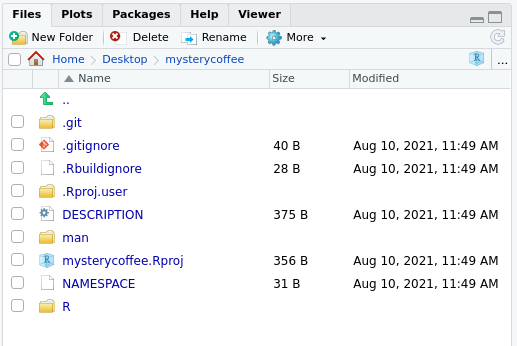

## How does a package look?

The minimal folder structure of a package looks like this

~~~sh
.
├── R
│   └── <R functions>
├── README.md
├── LICENSE
├── DESCRIPTION
└── NAMESPACE
~~~
{: .source}

where:

- The folder `R` contains all the `R` code (more on chapter FIXME).
- The `README.md` file contains human-readable information about the package (more on chapter FIXME).
- The `LICENSE` contains information about who and how can use this package (more on chapter FIXME).
- The `DESCRIPTION` file contains information about the package itself (more on chapter FIXME).
- The `NAMESPACE` file is automatically generated and tells R which functions can be accessed (more on chapter FIXME).

## A minimal package

The menus in `RStudio` will help us greatly.
Now we'll open `RStudio` and look at the upper left corner.
Let's press `File > New project > New directory`, and we'll see a menu like this:

As you can guess, now we'll press `R package`.
The new menu asks us to fill some information.
For the moment, just stay with me and fill it like this:

Notice that:

- We gave the package a name: `mysterycoffee`.
- I created my package on my `~/Desktop` folder, but you can use another location if you prefer.
- We ticked `Create git repository`. We'll be back to `git` on episode FIXME.
- We left `Use renv with this project unticked`.
- We ticked `Open in new session`.

Now we are ready to press `Create Project`.

> ## What did just happen?
> After pressing `Create Project`, a new `RStudio` window should have appeared.
> The working folder should be `mysterycoffee`, and it should already have some contents:
> 
> 
>
> Also, the file `./R/hello.R` would appear open in the editor.
> This is an example file that will help you writing your first packaged R functions.
{: .callout}

> ## The `hello.R` file
> Take a look at the `hello.R` file.
> You'll see that it contains a tiny function and some comments.
> The comments are actually more important that the function itself.
> They contain very useful tips about how to install, check and test the package.
{: .callout}

## Play with the package

Believe it or not, this package is ready to be installed.
Just go to the upper right corner and press `Build > Install and Restart`.

This will install and attach the package.
Now, you can use `hello`, the only function that this package contains so far.
If you try it by using:

~~~r
hello()
~~~
{: .source}

it should print:

~~~r
# Hello, world!
~~~
{: .output}

## More advanced folder structures
In this course we will show you how to unleash the full power of packaging.
In order to do so, we will use some optional folders.
You can see an overview below

~~~sh
.
├── R
│   └── <R functions>
├── data (optional)
│   └── <data>
├── tests (optional)
│   ├── testthat.R
│   └── testthat
│       └── <tests>
├── vignettes (optional)
│   └── <Rmd vignettes>
├── inst (optional)
│   └── <any other files>
├── README.md
├── LICENSE
├── DESCRIPTION
└── NAMESPACE
~~~
{: .source}

where:

- The `data` folder contains, as the name suggests, data (more on chapter FIXME).
- The `tests` folder contains unit tests, that will be very useful for making our package robust and mantainable (more on chapter FIXME).
- The `vignettes` folder contains documentation in `Rmd` format. As we'll see, this is a very suitable format for your reports and publications (more on > chapter FIXME).
- The `inst` folder contains any extra file you may want to include (more on chapter FIXME).


