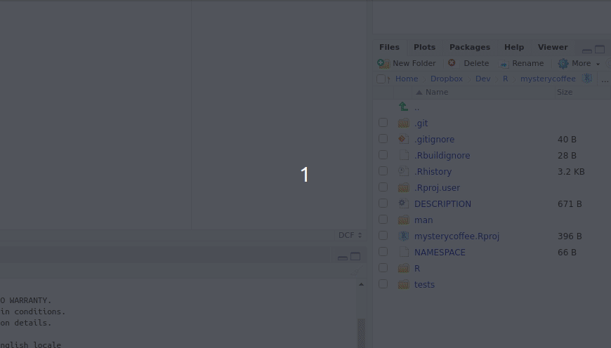
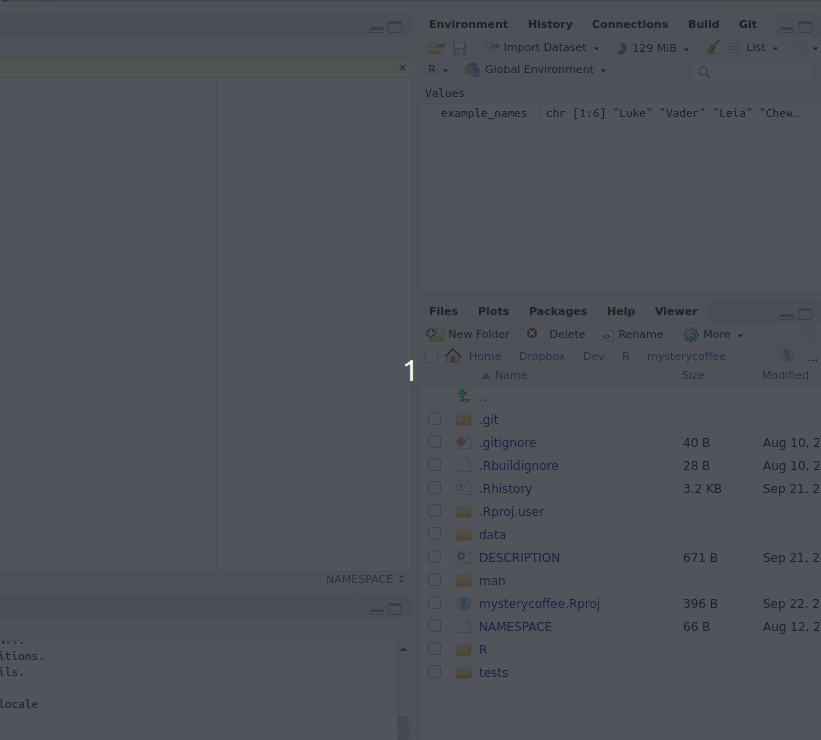

## Packaging data

In some situations, it could be a good idea to include data sets as part of your package.
Some packages, indeed, include **only** data.

Take a look, for instance, at the `babynames` package.
According to [the package description](https://cran.r-project.org/web/packages/babynames/index.html), it contains _"US baby names provided by the SSA"_.

In this chapter we will learn how to include some data in our package.
This can be very useful to ship the data together with the package, in an easy to install way.

> ## Is your data too big?
> Packages are typically not larger than a few megabytes.
>
> If you need to deal with large datasets, adding them to the package is not an advisable solution.
> Instead, consider using [Figshare](https://figshare.com/) or similar services.
{: .callout}

## The `data` folder

### Step 0: create the `data` folder

As we saw in [episode 3](../03-getting_started), packages have an optional `data` folder.
As perhaps you can guess, we will use this folder to store data.

To begin with, let's create the `data` folder:

### Step 1: store some data

Now, we need some data to be saved.
Let's imagine we want to save an example dataset including some names.
Particularly, these ones:

~~~r
example_names <- c("Luke", "Vader", "Leia", "Chewbacca", "Solo", "R2D2")
~~~
{: .code}

We can save the variable `example_names` inside the `data` folder as `example_names.RData`.

> ## Data and `usethis`
>
> For the most console-oriented users, it can be good to know that what we did is equivalent to:
>
> ~~~r
> example_names <- c("Luke", "Vader", "Leia", "Chewbacca", "Solo", "R2D2")
> usethis::use_data(example_names)
> ~~~
> {:. code}
>
{: .callout}

### Step 2: document your data

Everything you put inside your package needs some documentation.
Data is no exception.
But, how to document it?
The answer is easy: not very differently as did with functions in [episode 6](../06-documentation).

An example documentation string for our data could be:

~~~txt
#' Example names
#'
#' An example data set containing six names from the Star Wars universe
#'
#' @format A vector of strings
#' @source Star Wars
"example_names"
~~~
{: .code}

We'll save this text in `R/example_names.R`, and we are ready to go.

> ## Checking that everything went ok
>
> In the build panel, press install and restart.
> Now, type `?example_names` in the console.
> Do you see some information about the dataset?
>
> Tip: if not, make sure that you activated `Generate documentation with Roxygen` in the `Build/More/Configure build tools` tab.
{: .callout}

## A note about raw data

It should be noted that the way of dealing with data we just described will **only** work with _R_ data files, that is, those with `.rda` or `.RData` extensions.

If you need to include raw data inside your package, please take a look at section [14.3 of the excellent R Packages tutorial](https://r-pkgs.org/data.html) by Hadley Wickham.


