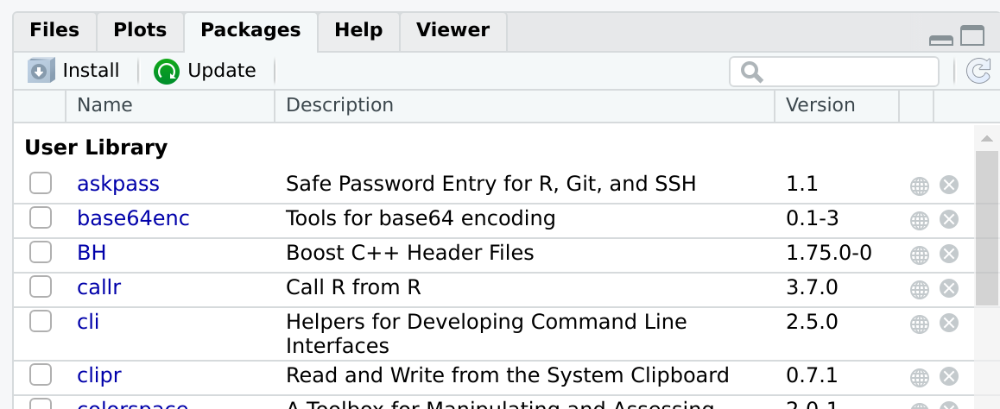
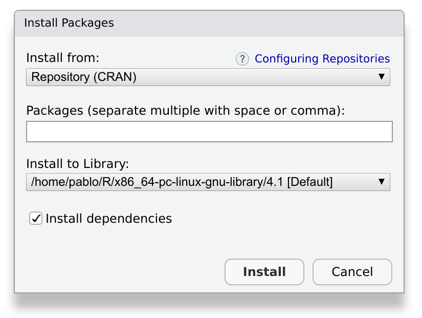
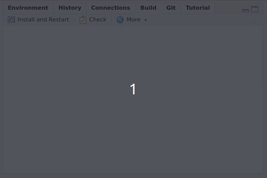

  
::: questions
- How do I use someone else's package?
- How do I use my own package?
- What is the difference between installing and attaching?
:::

::: objectives
- Install packages from CRAN
- Install packages from other locations, such as GitHub
- Build, install and attach your own packages
:::

::: instructor
To most learners of this lesson, installation instructions are common knowledge.
This part of the lesson may therefore be experienced as somewhat slow, and we encourage you to be sensitive to this.
We have chosen to be comprehensive in this episode, and include installation instructions from CRAN alongside those from other platforms.
This provides context to some new functionality; functionality that is quite essential when distributing a first package (which is easiest done through e.g. GitHub).
:::

## Installing packages

To use any R package, it must first be **installed**.
This means that the package is saved to our system in a standard location, and a usable way.
This allows us to use the functions contained in the package.

There are many ways of installing packages to our system.
In this section, we will look at the most common ones.

### Install a package from CRAN

[CRAN](https://cran.r-project.org/) is the official repository for R Packages.
It stands for the _Comprehensive R Archive Network_.
It is an awesome collection of high quality resources written by other R users just like you.

Installing a package from CRAN is particularly easy.
For example, we would like to install the package `devtools`.
The package can be installed by opening RStudio and browsing to the _Packages_ tab:

{alt="a screenshot of the Packages tab in Rstudio"}

This tab has a button, _Install_.
After pressing this button, a window will appear:

{alt="A screenshot of a window dialog in Rstudio, labeled 'Install Packages'"}

We write `devtools` in the field labeled _Packages_, and make sure to check the box labeled _Install dependencies_.
When we press _Install_, Rstudio will download and install the package, as well as the required dependencies.
Depending on the package, this may take a while, ranging from a few seconds to a few minutes.

### The same, but with a command
We can achieve the same result by typing code into the console:

```r
install.packages("devtools")
```

If you used the graphical interface, you may have noticed that Rstudio put this same command into the console.
This happens often with RStudio, and is a useful feature: while you use the graphical interface, RStudio will build and execute the corresponding command for you.

You can confirm that the installation was successful by checking the _Packages_ tab.
The newly installed package should appear there.

::: callout
## Something went wrong?
Sometimes, an installation may fail.
If that is the case, take a look at the output message in the console.
It will contain very useful information, and often contains direct suggestions about how to fix the problem.
:::

### Install a package from GitHub

Although CRAN is the official repository for R packages, it is not the only one you can use.
A very interesting alternative is [GitHub](https://github.com), a popular open code repository.
We can use GitHub to find packages or to make our own packages publicly available.
Contrary to CRAN, packages in GitHub are not reviewed.
This has an advantage: you can have your package published there immediately.

To install a package from GitHub, we need the package `devtools`, which we have just installed.
`devtools` contains functionality to install packages from many different sources.

To install a package from GitHub, we will use the following function:

```r
devtools::install_github("PabRod/kinematics")
```

This installs the package `kinematics` from the github page [github.com/PabRod/kinematics](https://github.com/PabRod/kinematics).

::: callout
## Removing packages

Of course, you can also undo the installation of a package.
Using the _Packages_ tab in Rstudio, you can click on the `x` icon next to a package to delete it from your system.
In the console, the function `remove.packages()` does the same.
For example, to remove `kinematics`:

```r
remove.packages("kinematics")
```
:::

There are several other functions available in the `devtools` package to install a package from other locations than GitHub.
They all start with `devtools::install_`.

::: challenge
## Install a package from a repository

Find an R package on a public repository, such as [GitHub](https://github.com) or [GitLab](https://gitlab.com), and install it with devtools.

If you have trouble finding a package, you can try:

- From GitHub: [github.com/Lchiffon/wordcloud2](https://github.com/Lchiffon/wordcloud2)
- From GitLab: [gitlab.com/r-packages/psyverse](https://gitlab.com/r-packages/psyverse)

For an extra challenge: try to install them using different functions.

:::: hint
Hint: the function `devtools::install_git()` applies to any git repository.
::::
:::: solution
```r
devtools::install_github("Lchiffon/wordcloud2")
devtools::install_gitlab("r-packages/psyverse")
```
or
```r
devtools::install_git("https://github.com/Lchiffon/wordcloud2") 
devtools::install_git("https://gitlab.com/r-packages/psyverse") 
```
::::
:::

::: challenge
## Why would you want to install a package from GitHub?

Can you think of a situation where you would rather install from GitHub than from CRAN?

:::: solution
There are two common situations where you would want to use GitHub instead of CRAN:

The first and most obvious one is when **the package you want does not exist on CRAN**.
This can happen for many reasons.
Maybe the package is still work in progress, or does not pass the CRAN quality checklist.
Or perhaps the authors just do not want to publish it on CRAN.

The second situation is when **you need a cutting edge version of the package**.
R developers usually use GitHub for their everyday work, and only submit a new version to CRAN when they have accumulated enough changes.
If you need a very particular version of the package, usually GitHub is the place to go.
::::
:::

### Install a package from source

Finally, what if the package is only available on your computer?

Here, too, `devtools` can be used.
You can use `devtools::install_local()` to install a package from a zip file or a local directory.

However, most likely you will need to install a local package because it is the one you are building yourself.
This will be the case with the one we are building during this lesson.

::: instructor
The local installation will be very easy to do once everyone has their first package set up.
It is advised to wait with showing this workflow until this stage in the lesson: the chapter [Getting Started](getting_started.Rmd).
:::

In this case, you can use the _Build_ tab of your R project:

{alt="A moving image that shows a user clicking the Install and Restart button in Rstudio and starting the installation process"}

By pressing _Install and restart_ three things will happen:

1. The package will be, indeed, installed.
2. The R session will be restarted.
3. The package will be attached.

::: callout
## A short glossary
It is useful to keep in mind these three concepts:

1. **Build**: converts a local package into an installable package.
2. **Install**: adds the package to your local library, so it is ready to be _attached_ when desired.
3. **Attach**: loads the package's functions to your workspace, making them ready to be used.

When you press _Install and restart_, the three events happen in sequence.
:::

## Using packages

### Attaching a package
If you have used packages before, you may know that in order to start using an installed package, you can load it into workspace.
In `R` jargon this is known as _attaching_ the package.
This means that its functions and data will become available in your working session, so you can use them directly in your console and your scripts.

We can attach an installed package with the function `library(<package name>)`.
For example, after installing `devtools`, we can attach it to our workspace as follows:

```r
library(devtools)
```

From this moment on, all the functions in `devtools` are directly available, and we can refer to them by name.
For example, the function `install_github()` inside the package, can be called directly with its name:

```r
install_github()
```

## Using a function without attaching the package

Another way to use functions from installed packages, is with the syntax: `<package>::<function>`.

For instance, if we want to use the function `install_github` from the package `devtools` we can call it directly as:

```r
devtools::install_github()
```

This way, you make sure that there is no confusion between functions with the same name from different packages.

::: callout
Have you ever gotten an error because you wanted to use `filter()` from the `dplyr` package, but because the `dplyr` package was not attached, R used the `filter()` function from `stats` instead?

(I have!)

That would not have happened had I used `dplyr::filter()` directly!
:::

::: challenge
## To attach or not to attach?
If you are developing a package that depends on other packages, you will probably need to call functions from other packages.
These functions will be used in the functions of your own package.
When you do this, you should call functions from the other packages using the syntax `<package>::<function>`, and _not_ by using `library(<package>)` inside a package.

Do you have any idea why?

:::: solution
We want our package to do its work and leave no trace behind.
Using `library(<package>)` somewhere inside the package will attach the package without the user realizing.
Suddenly, additional functions are available to their workspace, and this may have unintended consequences.

Additionally, a common problem is that two packages may contain two functions with the same name.
Explicitly naming the package when calling the function prevents this confusion, and it ensures that the right function is used.
::::
:::

::: callout
## Out of scope: publishing your own package

### Distributing your package on GitHub

After you have set up your package, you can share it online in a public repository such as GitHub.
GitHub and Rstudio work well together with the version control system Git.
While this is out of the scope of the present course, if you are interested, we encourage you to take the course on [Version control with Git and GitHub](https://swcarpentry.github.io/git-novice/) (note [this supplemental on Git with Rstudio](https://swcarpentry.github.io/git-novice/14-supplemental-rstudio/index.html)), and this lesson chapter on [Collaborating via Github](https://carpentries-incubator.github.io/Reproducible-Publications-with-RStudio/10-github/index.html)).

### Can I publish my package on CRAN?

Most developers of CRAN packages are R users just like you and me.
If you have a package you are proud of, and you think it may be useful for someone else, consider [submitting it](https://cran.r-project.org/web/packages/submission_checklist.html).

:::

::: keypoints
- To use a package you have to install it
- There are several ways of installing a package
- To use a homemade package, you also have to build it
- The build, install and attach process is usually automated by RStudio
- Functions used inside your package are best referred to with their full name: `<package>::<function>()`
:::
