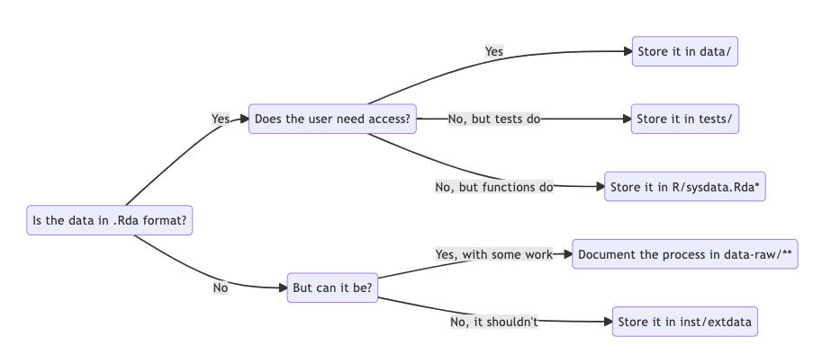
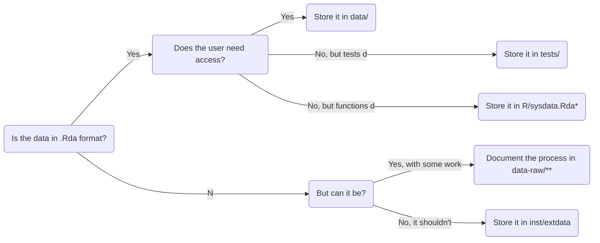

::: questions
- How can I include data in my package?
:::

::: objectives
- Learn how to use the data folder
:::


## Packaging data

In some situations, it could be a good idea to include data sets as part of your package.
Some packages, indeed, include **only** data.

Take a look, for instance, at the `babynames` package.
According to [the package description](https://cran.r-project.org/web/packages/babynames/index.html), it contains _"US baby names provided by the SSA"_.

In this chapter we will learn how to include some data in our package.
This can be very useful to ship the data together with the package, in an easy to install way.

::: callout
## Is your data too big?
Packages are typically not larger than a few megabytes.

If you need to deal with large datasets, adding them to the package is not an advisable solution.
Instead, consider using [Figshare](https://figshare.com/) or similar services.
:::

## Using R data files

R has its own native data format, the R data file.
These files are recognizable by their extensions: `.rda` or `.RData`.
Using R data files is the simplest approach to data management inside R Packages.

### Step 1: let R know that you'll use data

We can add data to our project by letting the package `usethis` help us.
In the snippet below, we generate some data and then we use `usethis` to store it as part of the package:


``` r
example_names <- c("Luke", "Vader", "Leia", "Chewbacca", "Solo", "R2D2")
```

``` r
usethis::use_data(example_names)
```

::: challenge
## What happened?
Type and execute in your console the code we just showed.
What does it do?
Does it require any further action from our side?

::: solution
It provides a very informative output.
Probably you'll see something like this:
```output
✔ Setting active project to '<working folder>/mysterycoffee'
✔ Saving 'example_names' to 'data/example_names.rda'
• Document your data (see 'https://r-pkgs.org/data.html')
```

So, what happened is that it created the file `example_names.rda` inside the `data` folder.
Additionally, it activated the project, but that's not very relevant because most likely the project was already active.

The last element in the list shows something that **didn't** happen: the data documentation.
Actually, we are asked to do it ourselves.
`usethis` is kind enough to provide us with a link with further information, in case we need it.

So let's move to the second (and last) step, and document our data.
:::
:::

### Step 2: document your data

Everything you put inside your package needs some documentation.
Data is no exception.
But, how to document it?
The answer is easy: not very differently as did with functions in [the documentation episode](documentation.Rmd).

An example documentation string for our data could be:

```
#' Example names
#'
#' An example data set containing six names from the Star Wars universe
#'
#' @format A vector of strings
#' @source Star Wars
"example_names"
```

We will save this text in `R/example_names.R`, and we are ready to go.

## Checking that everything went ok

In the build panel, press install and restart.
Now, type `?example_names` in the console.
Do you see some information about the dataset?

Tip: if not, make sure that you activated `Generate documentation with Roxygen` in the `Build/More/Configure build tools` tab.

## Using raw data

Sometimes you need to use data in formats other than `.rda`.
Examples of this are `.csv` or `.txt` files.

In order to store raw data in your package, you have to save them in `inst/extdata`.
For example, we can add our example names vector here as a text file:


``` r
dir.create("inst/extdata", recursive = TRUE)
writeLines(example_names, "inst/extdata/names.txt")
```

Then, after we reload the package, our users will be able to access this file path using `system.file`:

``` r
filepath <- system.file("extdata", "names.txt", package = "mysterycoffee")
readLines(filepath)
```

``` output
[1] "Luke"      "Vader"     "Leia"      "Chewbacca" "Solo"      "R2D2"     
```

::: discussion
When do you think is it useful for a package to include data that do not have the `.rda` or `.RData` extensions?
:::

:::: solution
Having files without the _R_ extensions is useful when one of the main purposes of the package is to read external files. For instance, the  [readr](https://readr.tidyverse.org/) package loads rectangular data from files where the values are comma- or tab-separated.
::::

## Summary

Data handling inside R packages can be a bit tricky.
The diagram below summarizes the most common cases:



::: instructor

The diagram was created with mermaid. This is the original code:


:::

*) `R/sysdata.Rda` is a file dedicated to (larger) data needed by your functions. Read more about it [here](https://r-pkgs.org/Data.html#sec-data-sysdata).

**) `data-raw/` is a folder dedicated to the origin and cleanup of your data. Read more about it [here](https://r-pkgs.org/Data.html#sec-data-data-raw).

If you need further help, please take a look at [section 14.3](https://r-pkgs.org/data.html) of the excellent [R Packages tutorial](https://r-pkgs.org/index.html) by Hadley Wickham.

::: keypoints
- R packages can also include data
:::
