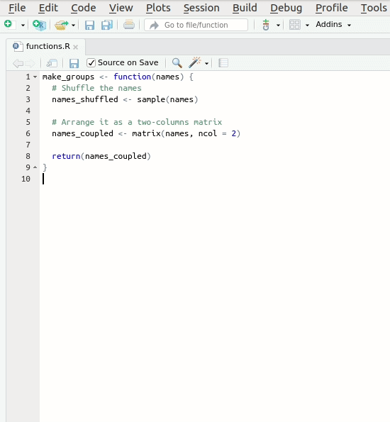
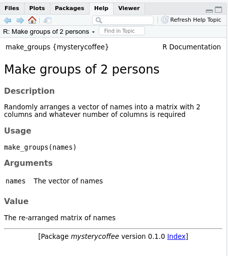

::: questions
- How can I make my package understandable and reusable?
:::

::: objectives
- Write a readme
- Use roxygen2 for creating documentation
- Use roxygen2 for managing the NAMESPACE file
:::


## Why documenting?

Your code is going to be read by people, for instance:

- People interested in your research.
- Potential users of your code.
- Colleagues and collaborators.
- Yourself, in the future, after you forgot all the tiny details.

For this and other reasons, it is a very good idea to invest some time in writing good documentation.

## The README

The first, and perhaps most important document of any coding project is the readme file.
This file typically has the name `README.md` and is located at the root folder, just at the same level as `DESCRIPTION` or `NAMESPACE`.

The readme file provides the very first contact with your code to potential users.

::: discussion
## What do you want to tell your potential users?
Try to put yourself in the shoes of your potential users.
They can be collaborators, people who found you code on the internet, ...

What do you think they would like to know?

Now, take a look at the [README from github.com/PabRod/kinematics](https://github.com/PabRod/kinematics).

What subjects are addressed in this README? As a potential user, is there anything that you miss?

With the results of this discussion, write a short README file for our package.

Get started with `usethis::use_readme_md()` to generate a default README.md file.
:::

::: callout
## (Optional) Readme rendering
One of the advantages of having a `README.md` is that most code repositories render this file as a nicely-formatted reader-friendly text.
See, for instance, the "main page" of the `kinematics` package on GitHub ([link](https://github.com/PabRod/kinematics)).
In GitHub, you can even create a [readme about yourself](https://github.com/PabRod)!

If you want to know more about GitHub, please take a look at the Software Carpentries' [lesson on Version Control](https://swcarpentry.github.io/git-novice/).
:::

## Documenting your functions with `roxygen2`

As we saw, the purpose of the readme is to _welcome_ whoever happens to be looking at your project.
This means that it is rarely the place for very technical information, such as the one describing the way your functions work.
The most practical way of documenting your functions is by integrating the documents as part of the functions.
This is exactly what the package `roxygen2` helps us with.

`roxygen2` is a package that makes writing packages much easier.
In particular, `roxygen2` takes care of your functions' documentation.
As a bonus, it also takes care of the `NAMESPACE` file.
If you don't have it installed (you can check by trying `library(roxygen2)`), please do it now (`install.packages("roxygen2")`).

Unfortunately, using it requires manually configuring a few things.
Please follow these steps:

::: checklist
## Using `roxygen2` for the first time
- Delete `NAMESPACE`. `roxygen2` will create a new one for you.
- Delete the `man/` folder. `roxygen2` will create a new one for you.
- In the upper right panel, go to `Build More Configure Build Tools`. You'll see a menu like this:

- Tick `Generate documentation with Roxygen`.
A new menu will appear:

- Tick `Install and restart`.

And you are all set!
:::

Let's create our first `roxygen` skeleton.
You can follow the steps in the animation below.
Please note that, before pressing `Code > Insert Roxygen skeleton` your cursor has to be inside the function's body.



Let's take a look at the _skeleton_. It contains:

- A `Title` section, where you can write what your function does. You can use add more comment lines below for a long description.
- The `return` field refers to the function's output.
- The `params` field(s) refer to each of the function's input(s).
- The `export` field means that this function should be exported to the `NAMESPACE`. We'll discuss it further later.
- The `examples` field is used, as you can guess, for adding examples to the documentation. We'll not use it now, so we can delete it. If you are interested in this or other optional parameters, please refer to [`roxygen2` documentation](https://cran.r-project.org/web/packages/roxygen2/vignettes/roxygen2.html).

::: challenge
## Write the docs
Take 5 minutes to edit the skeleton with real documentation.
In particular:

1. Add a title.
2. Describe, below the title, what the function does.
3. Describe the parameter `names`.
4. Describe the output that is returned.
5. Ignore `@export`.
6. Delete `@examples`.

:::: solution
The documentation should look approximately like this:

```r
#' Make groups of 2 persons
#'
#' Randomly arranges a vector of names into a matrix with 2 columns and
#' whatever number of columns is required
#'
#' @param names The vector of names
#'
#' @return The re-arranged matrix of names
#' @export
#'
make_groups <- function(names) {
  # Shuffle the names
  names_shuffled <- sample(names)

  # Arrange it as a two-columns matrix
  names_coupled <- matrix(names, ncol = 2)

  return(names_coupled)
```

Please note that the documentation is even longer than the code.
There is nothing wrong about this, to the contrary.
If you have to choose between too few and too much documentation, go for too much without hesitation.
::::
:::

::: challenge
## The `export` field
In case you don't want your function to be directly accessible for users of your package, you just have to delete the `@export` keyword from the function documentation.
But, why would you want that?
Can you think of an example where hiding a function can be a good idea?

:::: solution
Sometimes packages use auxiliary functions that perform intermediate operations.
Writing functions for these operations can be very useful for the developer, but confusing for potential users.
If that's the case, it can be a good idea to not export those functions keeping them only internally available.
::::
:::

Now that we have written the documentation, we are ready to build it.
As you will see, the process is quite automatic.

## Building the documentation
If you configured `roxygen2` as we suggested in section _"Using `roxygen2` for the first time"_, the documentation will be generated every time you press _"Install and restart"_ in the _"Build"_ menu at the upper right side of `RStudio`. The tab will also contain a _"Document"_ only:


::: challenge
## Writing the `NAMESPACE`
The documentation build also created the `NAMESPACE` file.
Can you open it and describe what do you see?
What does it mean?

:::: solution
The `NAMESPACE` file should look like:

```txt
# Generated by roxygen2: do not edit by hand

export(make_groups)
```

The `export` command guarantees that the function `make_groups` will be available for the final users of the package.

The comment is also worth noting: you don't have to edit this file by hand; `roxygen2` will take care of it.
::::
:::

## Reading the documentation

After generating the documentation and installing the package, the documentation generated by `roxygen2` can be accessed as usual in `R` using a question mark and the name of the function we are interested in:

```r
?make_groups
```

The help menu will open and show something like this:



::: keypoints
- Documentation is not optional
- All coding projects need a readme file
- roxygen2 helps us with the otherwise tedious process of documenting
- roxygen2 also takes care of NAMESPACE
:::
