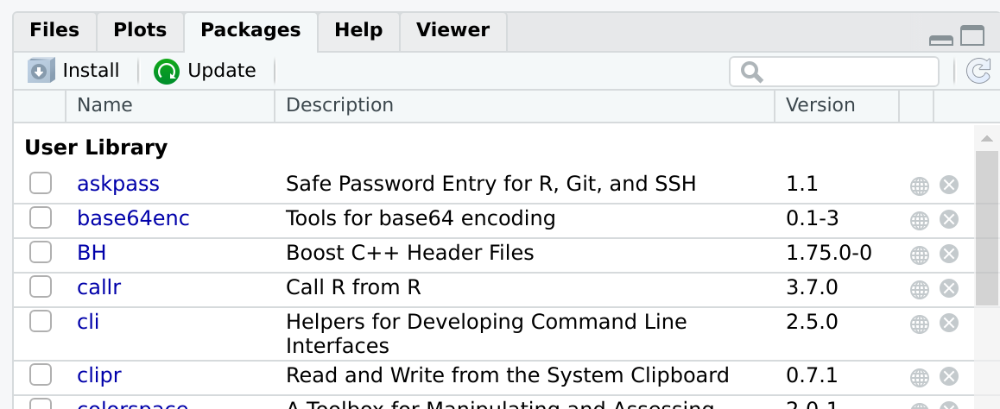
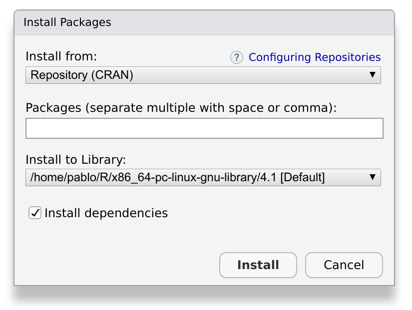
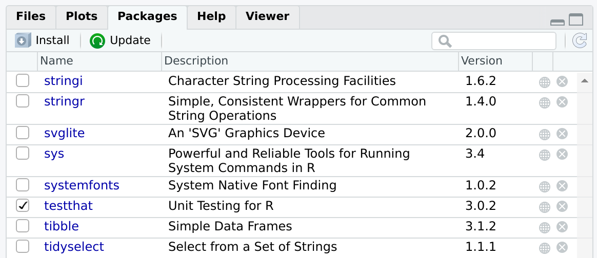
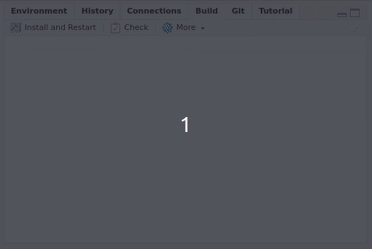

  
::: questions
- How do I use someone else's package?
- How do I use my own package?
- What is the difference between installing and attaching?
:::

::: objectives
- Install and attach packages from CRAN
- Install and attach packages from GitHub
- Build, install and attach your own packages
:::


One of the advantages of packages is that they can be **installed**.
This allows us to use the functions contained in the package from anywhere.

There are many ways of accessing a package in order to start using it.
In this section, we will look at the most common ones. It's very likely that you already know at least one of these methods if you are a regular R user.

At the end of this episode, we'll describe briefly some alternatives that may be useful in some cases.

## Install a package from CRAN

[CRAN](https://cran.r-project.org/) is the official repository for R Packages.
It stands for the _Comprehensive R Archive Network_.
It is an awesome collection of high quality resources written by other R users just like you.

Installing a package from CRAN is particularly easy.
Let's imagine we need to install a package with tools for R developers.
We can start by browsing to our favorite search engine, and make a search like: _R developers tools_.
Almost certainly it will point us to a package called `devtools`.
This package contains, among other things, functions to easily install from sources other than CRAN.
It will be useful in the next section.
The package can be installed by opening RStudio and browsing to the _Packages_ tab:



After pressing _Install_, a window like this will appear:



We write `devtools` in the prompt, and press install.
This operation will download and install the package and the required dependencies.
Depending on the package, it may take a while, ranging from a few seconds to a few minutes.

## The same, but with a command
Some people may prefer using code instead of a graphical user interface to install a package.
Are you one of them?
Then, you'll like to know that all the above is equivalent to typing:

```r
install.packages("devtools")
```

As often happens with RStudio, you don't have to remember this command by heart.
You can keep using the graphical user interface and **observe** what happens in the console.
RStudio will build and execute the command for you.

After installing, the new package should appear in the _Packages_ tab.

::: callout
## Something went wrong?
Sometimes, an installation may fail.
If that's the case, take a look at the output message in the console.
It will contain very useful information, and direct suggestions about how to fix the problem.
:::

::: callout
## Can I publish my package in CRAN?

The answer is yes, and it is easier than you may think.
Most developers of CRAN packages are R users just like you and me.
If you have a package you are proud of, and you think it may be useful for someone else, consider [submitting it](https://cran.r-project.org/web/packages/submission_checklist.html).
:::

In the sections below we'll see how to install a package from other sources than CRAN.
But first, let's see how can we actually use our freshly installed package!

## Using an installed package

If you have used packages before, you may know that installing the package is not enough to start using it immediately. In order to use an installed package, you need to load it into workspace.
In `R` jargon this is known as _attaching_ the package.
This means that its functions and data will become available in your working session, so you can use them in your console and your scripts.
Additionally, the functions in your package will be added to the search path.

The easiest way to attach an installed package is by using the _Packages_ tab.
If you click on the package's name, the package's help menu will open.
If you click on the checkbox by the package's name (see figure below), the package will be attached.



The figure above shows that the package `testthat` is installed and attached.
Other packages, such as `stringi`, `stringr` or `svglite`, are installed but not attached.

::: challenge
## What if we want to attach a package from the console?
How would you attach an installed R package using the console?

Tip: As always with RStudio, it is a good idea to look at the console while we are performing operations in the graphical user interface.

:::: solution
Use `library(<package name>)`
::::
:::

## Using a function without attaching the package
In some situations it can be a good idea to load individual functions from a given package, but not the package itself.
This can be done using the syntax: `<package>::<function>`.

For instance, if we want to use the function `filter` from the package `dplyr` we can call it directly as:

```r
dplyr::filter()
```
Keep in mind that for this to work, `dplyr` has to be installed.

::: challenge
## To attach or not to attach?
If you are developing a package that depends on other packages, you'll need to call functions from other packages. These functions will be used in the functions of your own package. When you do this, it is strongly recommended to call functions from the other packages using the syntax `<package>::<function>`. Conversely, it is strongly advised to not use `library(<package>)` inside a package.

Do you have any idea why?

:::: solution
The dependencies of a package can become tricky.
A common problem is that two packages may contain two functions with the same name.
The more explicit the naming, the better.

Additionally, we have to keep our potential users in mind.
We want our package to do its work and leave no trace behind.
Using `library(<package>)` inside the package will attach the package without you realizing.
And when you're finished with your function, the package will still be attached.

We'll learn more about packages that depend on other packages in the episode [Dependencies](dependencies.Rmd)).
::::
:::

## Install a package from GitHub

Although CRAN is the official repository for R packages, it is not the only one you can use.
A very interesting alternative is [GitHub](https://github.com), the most popular open code repository.
We can use GitHub to find packages or to make our own packages publicly available.
Contrary to CRAN, packages in GitHub are not reviewed.
This has an advantage: you can have your package published there immediately.

::: challenge
## Find a package on github, bitbucket, or gitlab and install it with devtools
If you have trouble finding a package, try [github.com/PabRod/kinematics](https://github.com/PabRod/kinematics).

If you know how to install from GitHub already, try a package from GitLab. For instance, try [gitlab.com/r-packages/psyverse](https://gitlab.com/r-packages/psyverse).

:::: solution
```
devtools::install_github("PabRod/kinematics")
devtools::install_gitlab("r-packages/psyverse")

# or

devtools::install_git("https://gitlab.com/r-packages/psyverse") 
```
::::
:::

Learning how to publish your package on GitHub is out of the scope of the present course.
But, if you are interested, we encourage you to take the course on [Version control with Git and GitHub](https://swcarpentry.github.io/git-novice/) (note [this supplemental on Git with Rstudio](https://swcarpentry.github.io/git-novice/14-supplemental-rstudio/index.html)), and this lesson chapter on [Collaborating via Github](https://carpentries-incubator.github.io/Reproducible-Publications-with-RStudio/10-github/index.html)).

::: challenge
## Why would you want to install a package from GitHub?
Can you think of a situation where you'll rather install from GitHub than from CRAN?

:::: solution
There are two common situations where you'll want to use GitHub instead of CRAN:

The first and most obvious one is when **the package you want doesn't exist on CRAN**.
This can happen for many reasons.
Maybe the package is still work in progress, or doesn't pass the CRAN quality checklist.
Or perhaps the authors just don't want to publish it on CRAN.

The second situation is when **you need a cutting edge version of the package**.
R developers usually use GitHub for their everyday work, and only apply to CRAN when they have accumulated changes enough.
If you need a very particular version of the package, usually GitHub is the place to go.
::::
:::

## Install a package from source

What if the package is only available in your computer?
This is the case of the one we are building during this lesson.

The easiest way to install a package from source is by opening the package project and using the _Build_ tab:



By pressing _Install and restart_ three things will happen:

1. The package will be, indeed, installed.
2. The R session will be restarted.
3. The package will be attached.

::: challenge
## Why would you want to load a package from source
Can you think of a situation where you'll need to install and attach a package from source?

:::: solution
The most common situation is while you are developing a package.
Every now and then, you'll want to re-install and re-attach it to check that everything is working as expected.
::::
:::

::: callout
## A short glossary
It is useful to keep in mind these three concepts:

1. **Build**: converts a local package into an installable package.
2. **Install**: adds the package to your local library, so it is ready to be _attached_ when desired.
3. **Attach**: loads the package's functions to your workspace, making them ready to be used.

When you press _Install and restart_, the three events happen in sequence.
:::

::: keypoints
- To use a package you have to install and attach it
- To use a homemade package, you also have to build it
- The build, install and attach process is usually automated by RStudio
- There are several ways of installing a package
- The best way of installing packages is dependent on the developer and user needs
:::
