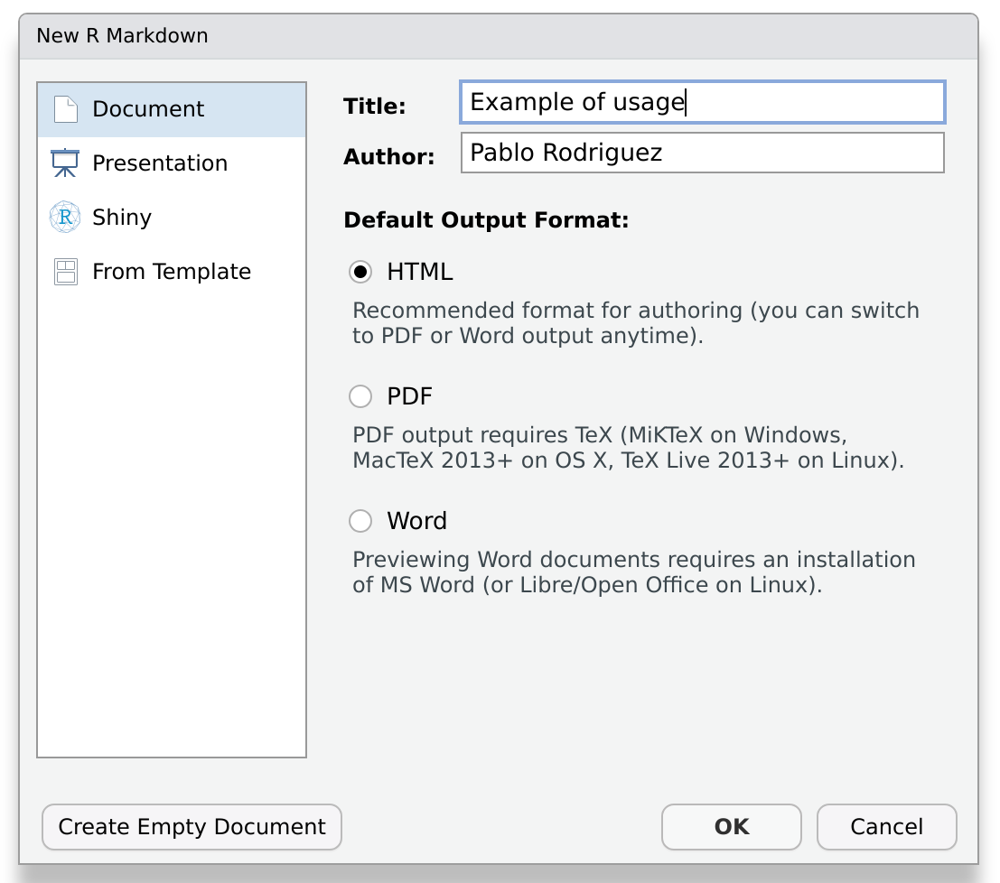
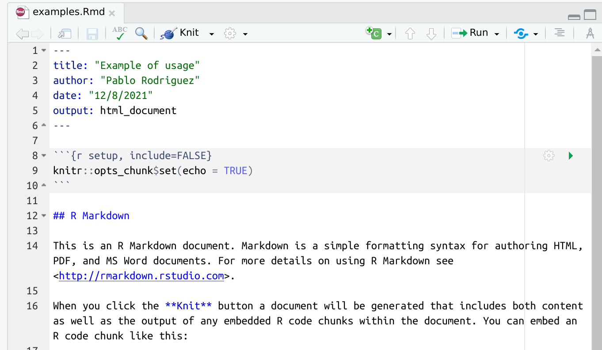

::: questions
- I have written my functions in my package, can I also use them?
- How can I write a tutorial or paper as part of my package?
:::

::: objectives
- Learn how to use write reports in the form of a vignette, using R Markdown.
:::

## Accessing vignettes

Your package now contains functions, and perhaps data.
Others can easily install your package, and use the functionality you created.
But, how do they know where to start?

Vignettes are a great way to create a guidebook or tutorial to your package.
You have probably already seen vignettes, as you were exploring a new package you were interested in using.

You can take a look at the vignettes that are available for a package with the function `browseVignettes`.
For example, this shows you the available vignettes for the `dplyr` package:

```r
browseVignettes("dplyr")
```

You can also directly open a vignette, if you know its name:

```r
vignette("dplyr", package="dplyr")
```

::: challenge
## Explore vignettes

Take some time to explore the vignette(s) of your favorite package(s).
What things do you notice?
What properties of vignettes stand out to you?

:::: solution
There are many things that can stand out about vignettes.
Some things that may be mentioned:

- Vignettes combine text with code, to give a comprehensive overview of the possibilities of a package.
- Not all packages have vignettes.
- Some packages have more than one vignette
- Vignettes can perform many different functions: they can be tutorials, clarify a specific purpose of a package, or even be a scientific report.
- Code inside a vignette may be executed: the vignette can also contain the results of this code run.
::::
:::

## Making a vignette

A vignette will take code from your package, execute it, generate the figures for you, and put everything together and in context.
The resulting document would be a human readable website, pdf file or even Microsoft Word file.

:::: callout
There are several reasons that make vignettes an excellent way to write up research.

For instance:
- It keeps all the work tidy in a single project folder.
- The document describes and performs the calculations, instead of only describing them.
- The document can be read as a text, but interested enough readers can also execute it, test it. In short: reproduce it.
::::


## `Rmarkdown` files

In `R`, vignettes are typically written using `.Rmd` (a shortening of `Rmarkdown`) files.
The name is self-descriptive: it is a file that combines **code** (in `R`) and **text** (in `markdown`).

Markdown is a way of creating formatted text using a plain-text editor.
Actually, it looks a lot like plain text, but with some special symbols every now and then indicating aesthetic details such as bold typeface, links, tables, ...
Markdown files can be rendered to reading-friendly formats, such as `html` or `pdf`.

This website is written in markdown.
Below you can the source for the last paragraph of the previous section.

```markdown
In `R`, vignettes are typically written using `.Rmd` (a shortening of `Rmarkdown`) files.
The name is self-descriptive: it is a file that combines **code** (in `R`) and **text** (in `markdown`).
```

Learning Markdown is not complex, and there are lots of good [cheat sheets](https://www.markdownguide.org/cheat-sheet/) available online.

We can easily create our first vignette using the RStudio menus.
Click on `File/New file/R Markdown`, and you'll see a window like the one below:



Fill in the field `Title` with the text: "Examples of usage", and press `OK`.

A new file will appear.
Before going further, let's save it.
Create a folder inside your project with the name `vignettes`, and save it there with the name `examples.Rmd`.

Now, let's take a look at the file.
Notice that the new file is not empty.
This is great!
RStudio created an example for us!



As always, it is instructive to read the message (in this case, the file) that RStudio generated for us.
We realize that:

- Several formatting options are present as examples (so we don't have to remember them!).
- Code blocks are surrounded by the symbol ```` ```{r <name>, <optional parameters>} ```` and end with ```` ``` ````.
- There is something called **knit** that seems to be important.

_"Knitting"_ is the process of generating a reader-friendly document.
And RStudio has a button for that.
Let's press it and see what happens.


Great, isn't it?

::: callout
## Can I knit markdown files to other formats than html?
Yes, and surprisingly easy indeed.
Just take a look a the expanded menu of the knitting button.

Be warned, anyways, that some output formats may require installing additional packages.
:::

::: callout
## Can I use vignettes with other language than R?
Yes, although this is advanced material that we'll not cover in detail in this course.
:::

## Our vignette

The template vignette we just created works fine, but it doesn't give any useful information about our package.
In this section we'll fix that.
We will create a report including some examples to show how great our package is!

::: challenge
## A vignette about `mysterycoffee`
Open the default vignette we created in the previous section.
Use it as a template (for instance, editing and removing parts of it) to turn it into a vignette about `mysterycoffee`, the package we created during this course.

What can you write?
Just let me give you a few suggestions:

What about beginning with a tiny **introduction** section?
If you don't feel creative, you can write something along the lines of: _"Working from home can be boring. Luckily, `mysterycoffee` is here to help"_.

Now, a **how to use it** section will be ideal.
It will require some code chunks:
A chunk to attach the package, a chunk to load some names and a chunk to make the groups.
Don't forget to insert explanatory text in between the chunks.

We may also need a chunk to actually display the groups formed after knitting.

:::: solution
This is what I wrote.
Of course, your text, and even your code, will most likely be different.

````{verbatim, lang = "markdown"}
---
title: "Example of usage"
author: "Pablo Rodriguez"
date: "12/8/2021"
output: html_document
---
## Introduction

Working from home can be lonely. Do you miss the random chats at the coffee machine? Certainly we do!

Luckily, our R package `mysterycoffee` is here to help.

## How to use it

Well, first you'll have to attach the package.

```{r install}
# library(mysterycoffee) # uncomment this line in the vignette
```

Afterwards, the package will need the names of your colleagues. These are mine:

```{r names}
names <- c("Pablo Rodríguez",
           "Lieke de Boer",
           "Barbara Vreede",
           "President Obama",
           "General Sun Tzu",
           "Pharaoh Hatshepsut")
```

Now we just have to use the function `make_groups` to assign the random coffee partners:

```{r assign}
groups <- make_groups(names)
```

And here you have the result!

```{r print, echo=FALSE}
print(groups)
```
````
::::
:::

::: instructor

In the solution above, the line `library(mysterycoffee)` is commented out.
This is a technical choice: due to the Carpentries Lesson Template being written in Rmarkdown,
this line caused the CI to attempt to install `mysterycoffee`... which of course does not exist.
Please make sure to point out when sharing this solution that the line must be uncommented
in a functional vignette.

:::

::: challenge
## Hiding chunks
Sometimes you don't want the content of the code chunk to be printed in the knitted document, but only its results.
How can you control this?

Hint: take a look at the menu that appears at the right upper corner of each chunk.

:::: solution
The menu in the upper corner of each chunk allows you to do multiple things.
Among them, it allows you to fine-control what will happen to every chunk.
You can comfortably choose among a combination of execute or not execute the chunk, display the code, the output, or nothing.

By the way, did you notice the effect of choosing one of these options in the file itself?
When yoy choose, for instance, _show output only_, the parameter `echo=FALSE` will be added to the chunk header.
::::
:::

::: keypoints
- Reports can be part of the package
:::
