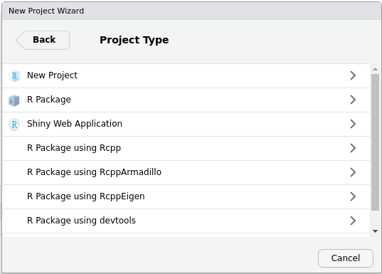
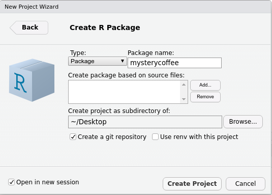
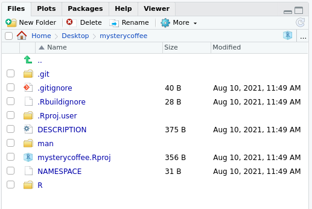

::: questions
- "I want to write a package. Where should I start?"
:::

::: objectives
- "Create a minimal package"
:::


## What does a package look like?

The minimal folder structure of a package looks like this

```
.
├── R
│   └── <R functions>
├── README.md
├── LICENSE
├── DESCRIPTION
└── NAMESPACE
```

where:

- The folder `R` contains all the `R` code (more on this in [Writing our own functions](functions.Rmd)).
- The `README.md` file contains human-readable information about the package (more on this in [the Documentation episode](documentation.Rmd)).
- The `LICENSE` contains information about who and how can use this package (more below).
- The `DESCRIPTION` file contains information about the package itself (more information in the [episode on Dependencies](dependencies.Rmd)).
- The `NAMESPACE` file is automatically generated and tells R which functions can be accessed (more in [the Documentation episode](documentation.Rmd)).

## A minimal package

The menus in `RStudio` will help us in creating the most minimal of packages.
Let's open `RStudio` and look at the upper left corner.
We will press `File > New project > New directory`, and see a menu like this:



As you can guess, we will now press `R package`.
The new menu asks us to fill in some information.
For the moment, bear with me and fill in the following:



Notice that:

- We gave the package a name: `mysterycoffee`.
- I created my package on my `~/Desktop` folder, but you can use another location if you prefer.
- We left `Create git repository` unticked. If you want to know more about `git`, please refer to our courses on [Version control](https://swcarpentry.github.io/git-novice/). Integrating packages with Git is very useful, but we will not talk about it in this lesson.
- We left `Use renv with this project unticked`.
- We ticked `Open in new session`.

Now we are ready to press `Create Project`.

::: callout
## What just happened?
After pressing `Create Project`, a new `RStudio` window should have appeared.
The working folder should be `mysterycoffee`, and it should already have some contents:



Also, the file `./R/hello.R` would appear open in the editor.
This is an example file that contains a toy function.
Its only functionality is to, well, to say _"hello"_.
This may sound silly, but it will help you writing your first packaged R functions.
:::

::: callout
## The `hello.R` file
Let's take a look at the `hello.R` file.
You'll see that it contains a tiny function and some comments.
The comments are actually more important than the function itself.
They contain very useful tips about how to install, check and test the package.

As a rule of thumb: always read the contents of the example files RStudio creates for you.
:::

## Play with the package

Believe it or not, this package is ready to be installed.
Just go to the upper right corner and press `Build > Install and Restart` (or, in newer versions of RStudio, press `Build > Install > Clean and install`).


This will install and attach the package. The package contains only one function so far: `hello()`.

::: challenge
## Try out the `hello()` function. Edit it, and reload the package.
1. What does it print?
2. Change this function to generate a different output. (Have fun with it, perhaps add an argument or two!)
3. Build and install the package, and call the function again to see that it works differently.

:::: solution

``` r
mysterycoffee::hello()
```

```output
[1] Hello, world!
```

We can add an argument like this:
```r
hello <- function(name) {
   print(paste0("Hello, ", name, "!"))
}
```

To use the updated function available in RStudio, we can use either
```r
devtools::load_all() # then call with hello("Luke")
devtools::install() # then call with mysterycoffee::hello("Luke")
```

Alternatively, we can also use the graphical user interface as above: `Build Install and Restart`.

*Note*: `load_all()` simulates installing and attaching the package. In larger projects, it allows us to iterate more quickly between changing functions and testing them in the console.
::::
:::

::: discussion
## Tell me how you load your functions
There are many ways of using functions, but all of them involve loading them into the workspace.
We just learned how to do that using a package.

**How do you usually work with functions?**
Perhaps you source them from an external file?
Do you usually work on a single, long script?

**Can you think of any advantage of using packages instead?**
Don't worry if the answer is no.
This is actually a difficult question at this stage.
We'll show the full power of packages along the course.
:::

## More advanced folder structures
In this course we will show you how to unleash the full power of packaging.
In order to do so, we will use some optional folders.
You can see an overview below

```
.
├── R
│   └── <R functions>
├── data (optional)
│   └── <data>
├── tests (optional)
│   ├── testthat.R
│   └── testthat
│       └── <tests>
├── vignettes (optional)
│   └── <Rmd vignettes>
├── inst (optional)
│   └── <any other files>
├── README.md
├── LICENSE
├── DESCRIPTION
└── NAMESPACE
```

where:

- The `data` folder contains, as the name suggests, data (more in [the Data episode](data.Rmd)).
- The `tests` folder contains unit tests, that will be very useful for making our package robust and mantainable (more in [the episode on Testing](testing.Rmd)).
- The `vignettes` folder contains documentation in `Rmd` format. As we'll see, this is a very suitable format for your reports and publications (more in [the Vignette episode](vignettes.Rmd)).
- The `inst` folder contains any extra file you may want to include (more in [the Data episode](data.Rmd)).

::: keypoints
- "A package is no more and no less than a folder structure"
- "RStudio can help you"
:::
