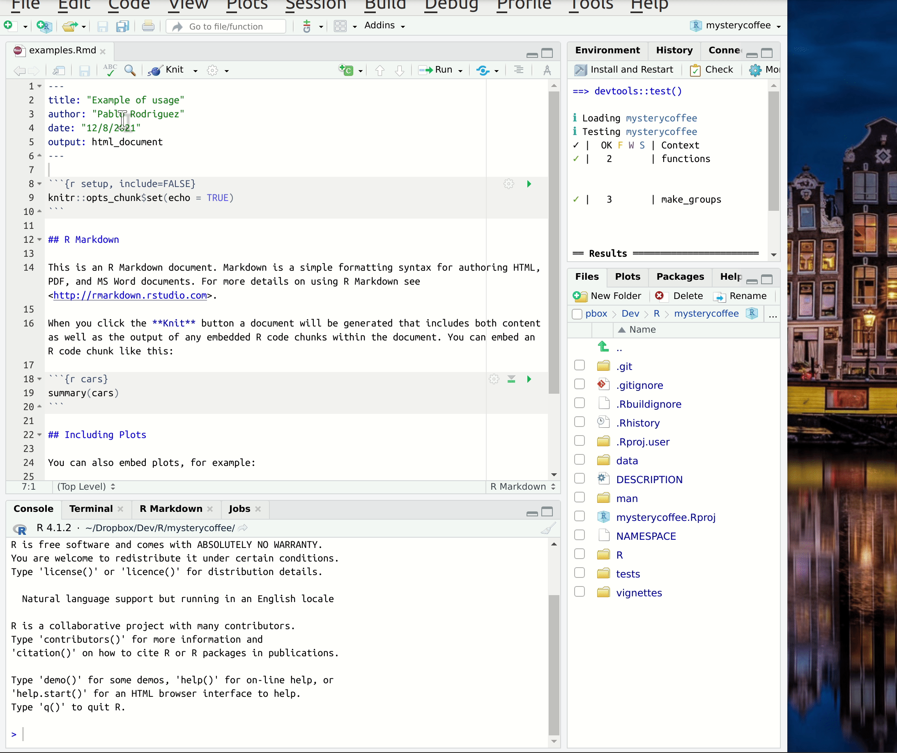

::: questions
- I have written the functions in my package, but can I also use them?
- How can I write a tutorial or paper as part of my package?
:::

::: objectives
- Learn how to write reports in the form of a vignette, using R Markdown.
:::

Your package now contains functions, and perhaps data.
Others can easily install your package, and use the functionality you created.
But, how do they know where to start?

Vignettes are a great way to create a guidebook or tutorial to your package.
You have probably already seen vignettes, as you were exploring a new package you were interested in using.

## Accessing vignettes

You can take a look at the vignettes that are available for a package with the function `browseVignettes`.
For example, this shows you the available vignettes for the `dplyr` package:

```r
browseVignettes("dplyr")
```

You can also directly open a vignette, if you know its name:

```r
vignette("dplyr", package="dplyr")
```

::: challenge
## Explore vignettes

Take some time to explore the vignette(s) of your favorite package(s).
What things do you notice?
What properties of vignettes stand out to you?

:::: solution
There are many things that can stand out about vignettes.
Some things that may be mentioned:

- Vignettes combine text with code, to give a comprehensive overview of the possibilities of a package.
- Not all packages have vignettes.
- Some packages have more than one vignette
- Vignettes can perform many different functions: they can be tutorials, clarify a specific purpose of a package, or even be a scientific report.
- Code inside a vignette may be executed: the vignette can also contain the results of this code run.
::::
:::

A vignette will take code from your package, execute it, and allow you to provide context and instructions around the functionality you created.
The resulting document would be a human readable website or a pdf file.
The possible applications for this are endless.
It can be a tutorial, a report, or even a scientific paper.

:::: callout
## Vignettes as research reports

There are several reasons that make vignettes an excellent way to write up research.

For instance:

- It keeps all the work tidy in a single project folder.
- The document describes and performs the calculations, instead of only describing them.
- The document can be read as a text, but interested readers can also execute it, test it. In short: they can reproduce the work.

::::

## `Rmarkdown` files

In `R`, vignettes are typically written using `.Rmd` (the extension of `Rmarkdown`) files.
The name is self-descriptive: it is a file that combines **code** (in `R`) and **text** (in `markdown`).

Markdown is a way of creating formatted text using a plain-text editor.
Actually, it looks a lot like plain text, but with some special symbols every now and then indicating aesthetic details such as bold typeface, links, tables, ...
Markdown files can be rendered to reading-friendly formats, such as `html` or `pdf`.

This website is written in markdown.
Below you can see the source for the last paragraph of the previous section.

```markdown
In `R`, vignettes are typically written using `.Rmd` (the extension of `Rmarkdown`) files.
The name is self-descriptive: it is a file that combines **code** (in `R`) and **text** (in `markdown`).
```

Learning Markdown is not complex, and there are lots of good [cheat sheets](https://www.markdownguide.org/cheat-sheet/) available online.

## Creating a vignette

Running the following code will generate an Rmarkdown document with your first vignette:

```r
usethis::use_vignette("example")
```

This will do the following:

1. Create a directory `vignettes`
1. Create the file `example.Rmd` inside this directory
1. If necessary, add dependencies to the `DESCRIPTION` file

### Editing the vignette

The file `example.Rmd` can now be edited.

Let's start with the header.
We can replace the title with a little more information:


``` yaml
---
title: "Examples of usage"
output: rmarkdown::html_vignette
vignette: >
  %\VignetteIndexEntry{test}
  %\VignetteEngine{knitr::rmarkdown}
  %\VignetteEncoding{UTF-8}
---
```

Scrolling down, we see that there is some R code in our vignette already.
This is fenced by so-called back-ticks: (```` ``` ````), as well as information about the programming language used: R.


```` default
```{r setup} 

```
````

This is called a 'code chunk'.
The word `setup` here is the name of the code chunk.
It can be useful to name code chunks, but it is optional.

Whenever we want to include code, we will need to do so inside a chunk like this.
Later, when we generate the final document, the code inside will be executed, and the results will be included in the vignette.

However, before we start writing code, we should start with an introduction.
How about:


``` markdown
## Introduction

Working from home can be lonely. Do you miss the random chats at the coffee machine? Certainly we do!

Luckily, our R package `mysterycoffee` is here to help.
```

### Knitting the vignette

_"Knitting"_ is the process of generating a reader-friendly document.
And RStudio has a button for that.
Let's press it and see what happens.



## Making the vignette complete

The template vignette we just created works fine, but it doesn't give any useful information about our package.
In this section we will fix that.
We will create a report including some examples to show how great our package is!

::: challenge
## A vignette about `mysterycoffee`

For this exercise, add code chunks and markdown text to make the vignette complete.
Think about what a user may want to know when first encountering the `mysterycoffee` package.

You can think about the following elements:

- Describe the purpose of the package (markdown)
- Show how to attach the package (a code chunk)
- Show how to load some names (a code chunk)
- Use the `make_groups` function on the names, to make the groups (a code chunk)
- Display the groups formed after running `make_groups` (a code chunk)
- Explanatory text in between the chunks, to narrate the process (markdown)

:::: solution
This is what I wrote.
Of course, your text, and even your code, will most likely be different.


```` markdown
---
title: "Examples of usage"
output: rmarkdown::html_vignette
vignette: >
  %\VignetteIndexEntry{test}
  %\VignetteEngine{knitr::rmarkdown}
  %\VignetteEncoding{UTF-8}
---
## Introduction

Working from home can be lonely. Do you miss the random chats at the coffee machine? Certainly we do!

Luckily, our R package `mysterycoffee` is here to help.

## How to use it

Well, first you will have to attach the package.

```{r install}
# library(mysterycoffee) # uncomment this line in the vignette
```

The package will need the names of your colleagues. These are mine:

```{r names}
names <- c("Pablo Rodríguez",
           "Lieke de Boer",
           "Barbara Vreede",
           "President Obama",
           "General Sun Tzu",
           "Pharaoh Hatshepsut")
```

Now we just have to use the function `make_groups` to assign the random coffee partners:

```{r assign}
groups <- make_groups(names)
```

And here you have the result!

```{r print, echo=FALSE}
print(groups)
```
````
::::
:::

::: instructor

In the solution above, the line `library(mysterycoffee)` is commented out.
This is a technical choice: due to the Carpentries Lesson Template being written in Rmarkdown,
this line caused the CI to attempt to install `mysterycoffee`... which of course does not exist.
Please make sure to point out when sharing this solution that the line must be uncommented
in a functional vignette.

:::

::: callout
## Hiding chunks

Sometimes you don't want the content of the code chunk to be printed in the knitted document, but only its results.
This can be done by adding options to the code chunk.
The menu in the upper right corner of each chunk allows you to access the options.
You can choose to execute or not execute the chunk, to display the code, the output, or nothing.

As you change the options, you see the text change in the header of the code chunk.
When you choose, for instance, _show output only_, the parameter `echo=FALSE` will be added to the chunk header.

[Take a look at this page on `knitr` to learn more about chunk options.](https://yihui.org/knitr/options/)
:::

## Viewing our vignette

We can always render the vignette simply by knitting the document.
However, should you want to view the vignette in the same way as you access another package's vignette, you need to take an extra step.
We need to explicitly build the vignette on installing the package:

```r
devtools::install(build_vignettes = TRUE)
```

Note that clicking the "Install" button does not build the vignette in a way that allows access through the `vignette()` and `browseVignettes()` functions.

::: callout
## Viewing vignettes from a GitHub installation

If you have made a vignette, but your package is only accessible on GitHub, it is important to give explicit installation instructions for the vignette.
You use the same argument (`build_vignettes`) as with the local install:

```r
devtools::install_github(build_vignettes = TRUE)
```

Without this argument, the vignettes will not be included in the package installation.

:::

Now we can take a look at our own vignette!

```r
vignette("example", package="mysterycoffee")
```


::: keypoints
- Show how to use your functions in a vignette
- With RMarkdown, we can combine text, code, and output to a single document
- Vignettes are an integral part of an R package.
:::
